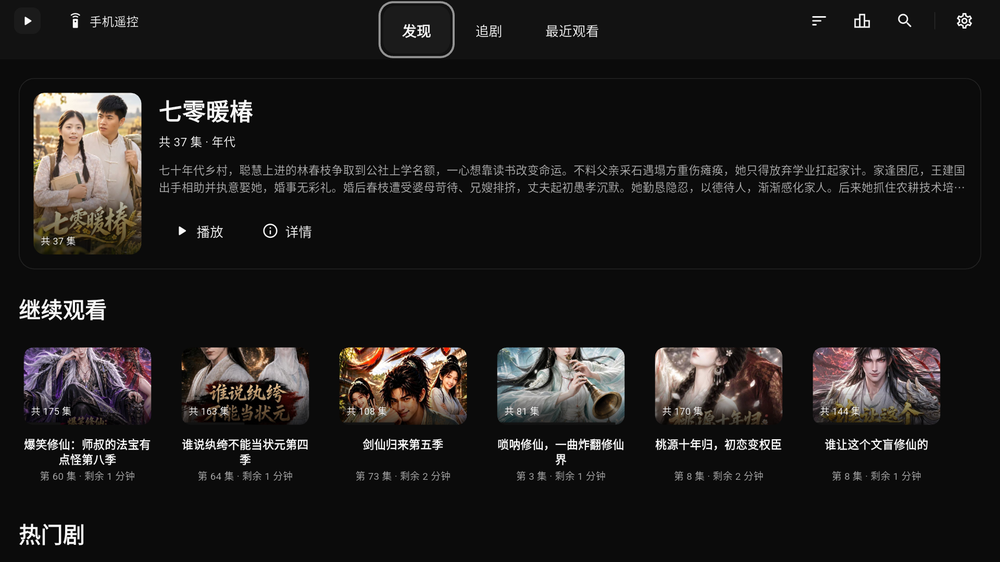
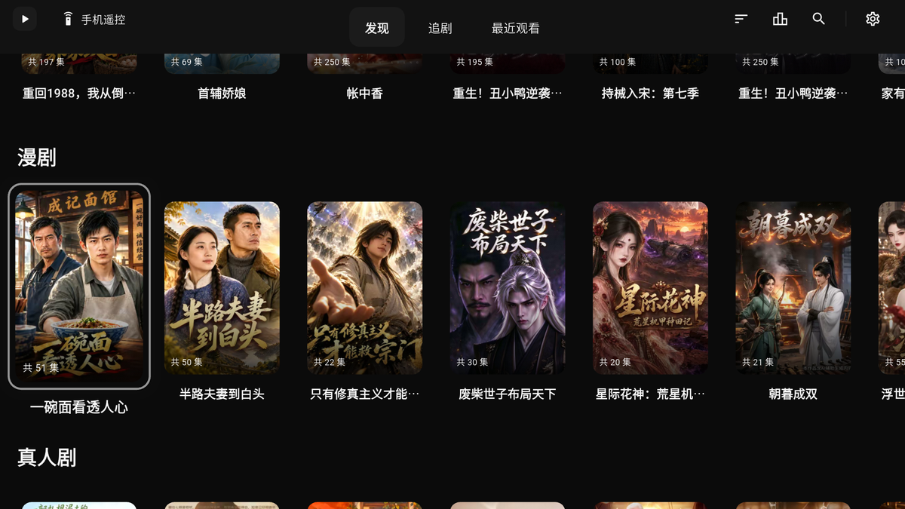
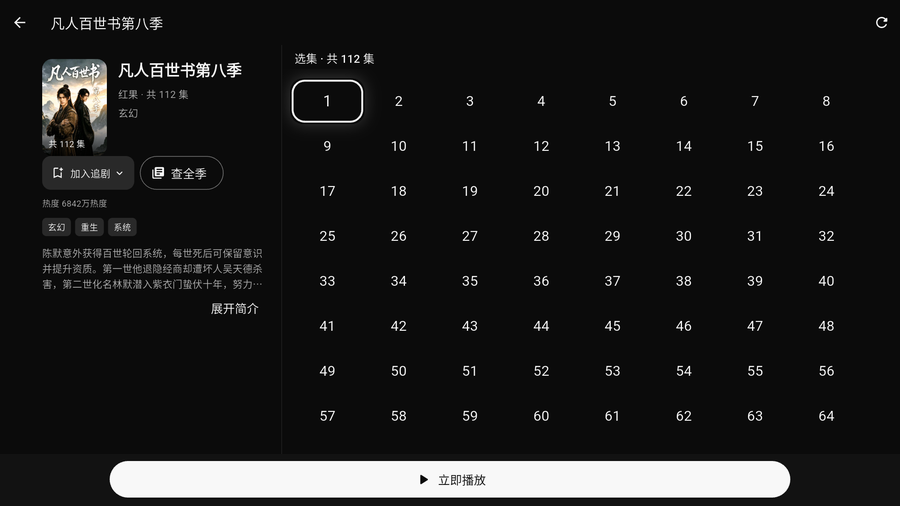
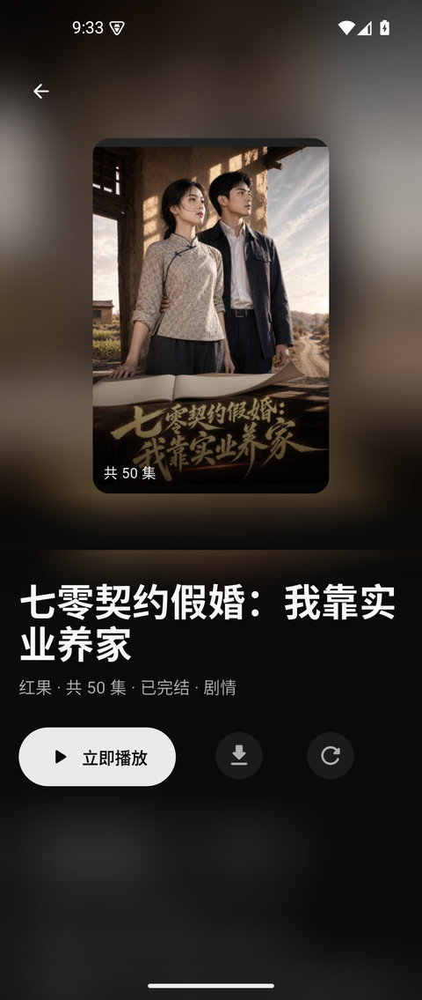

# 短剧之家 · 全平台下载

在手机、电脑、电视上找剧、接着上次看。支持搜索、收藏、选集、倍速、自动连播。

**免费使用 · 当前版本：手机版 `1.0.65+66` · 电脑版 `2.0.0+76` · TV 版 `1.0.60+61`**

> 每个下载按钮都给了**两条链接**：
> **加速下载**走公共加速服务，国内通常更快；连不上时点旁边的**官方直链**。

---

## 三个版本分别是什么

| 版本 | 装在哪 | 怎么操作 |
|---|---|---|
| **手机版** | 安卓手机 / 平板 | 触屏，竖屏；支持下载缓存、后台播放、有声书模式 |
| **电脑版** | Windows 10 / 11（64 位） | 键盘鼠标，横屏大画面；适合一次连看好几集 |
| **TV 版** | 电视盒子 / 智能电视 | 遥控器；为客厅大屏做了焦点高亮和字号放大 |

三个版本可以**同时装**，互不冲突；观看进度也能互相同步（见文末常见问题）。

---

## 手机版（安卓）

| 项目 | 说明 |
|---|---|
| 文件 | `duanjuzhijia2-1.0.65+66-arm64-v8a.apk` |
| 大小 | 33.9 MB |
| 适用 | 安卓 8.0 及以上（64 位） |

**⬇ [加速下载](https://gh-proxy.com/https://github.com/jackherex/duanjuzhijia-down-phone/releases/download/v2-app-v1.0.65-66/duanjuzhijia2-1.0.65%2B66-arm64-v8a.apk)**　｜　[官方直链](https://github.com/jackherex/duanjuzhijia-down-phone/releases/download/v2-app-v1.0.65-66/duanjuzhijia2-1.0.65%2B66-arm64-v8a.apk)

> 安装时系统可能提示「未知来源」或「未经检测」，允许本次安装即可。

---

## 电脑版（Windows 10 / 11）

### 两个文件有什么区别？

| 文件 | 是什么 | 适合谁 |
|---|---|---|
| `duanjuzhijia2-2.0.0+76-setup.exe`<br>**65.4 MB** | **安装版**：双击安装，自动创建桌面快捷方式，之后能在「设置 → 应用」里正常卸载。 | **大多数人选这个**，省事 |
| `duanjuzhijia2-2.0.0+76-windows-x64.zip`<br>**90.7 MB** | **免安装版**：解压到任意文件夹，双击里面的程序就能用。不写注册表，不要了直接删文件夹。 | 想放 U 盘随身带、或在别人电脑上用完就删 |

> 两个文件里的程序**功能完全一样**，只是打包方式不同 —— **装一个就行，不用都下**。

### 下载

**安装版**：⬇ [加速下载](https://gh-proxy.com/https://github.com/jackherex/duanjuzhijia-down-pc/releases/download/pc-app-v2.0.0-76/duanjuzhijia2-2.0.0%2B76-setup.exe)　｜　[官方直链](https://github.com/jackherex/duanjuzhijia-down-pc/releases/download/pc-app-v2.0.0-76/duanjuzhijia2-2.0.0%2B76-setup.exe)

**免安装版**：⬇ [加速下载](https://gh-proxy.com/https://github.com/jackherex/duanjuzhijia-down-pc/releases/download/pc-app-v2.0.0-76/duanjuzhijia2-2.0.0%2B76-windows-x64.zip)　｜　[官方直链](https://github.com/jackherex/duanjuzhijia-down-pc/releases/download/pc-app-v2.0.0-76/duanjuzhijia2-2.0.0%2B76-windows-x64.zip)

> 首次运行时若弹出蓝色的「Windows 已保护你的电脑」，点「更多信息 → 仍要运行」。
> 这是因为安装包没有购买数字证书，**不代表文件有问题**；可用文末的校验值核对文件是否完整。

---

## TV 版（电视盒子 / 智能电视）

### `arm64-v8a` 和 `armeabi-v7a` 有什么区别？

这两个名字代表**设备处理器的位数**：

| 文件 | 通俗说 | 什么时候选 |
|---|---|---|
| `duanjuzhijiatv-1.0.60+61-arm64-v8a.apk`<br>**30.3 MB** | **64 位版** | **先试这个**。近几年的盒子和智能电视基本都是 |
| `duanjuzhijiatv-1.0.60+61-armeabi-v7a.apk`<br>**38.5 MB** | **32 位版** | 上面那个**装不上或打开就闪退**时换这个 |

> ⚠️ **重要**：很多电视盒子的芯片是 64 位，但厂家只提供了 32 位系统 —— 这种情况
> **只能装 32 位版**。所以「64 位版装不上」**不代表盒子有问题**，换成 32 位版就行。

### 下载

**64 位版**：⬇ [加速下载](https://gh-proxy.com/https://github.com/jackherex/duanjuzhijia-down-tv/releases/download/tv-app-v1.0.60-61/duanjuzhijiatv-1.0.60%2B61-arm64-v8a.apk)　｜　[官方直链](https://github.com/jackherex/duanjuzhijia-down-tv/releases/download/tv-app-v1.0.60-61/duanjuzhijiatv-1.0.60%2B61-arm64-v8a.apk)

**32 位版**：⬇ [加速下载](https://gh-proxy.com/https://github.com/jackherex/duanjuzhijia-down-tv/releases/download/tv-app-v1.0.60-61/duanjuzhijiatv-1.0.60%2B61-armeabi-v7a.apk)　｜　[官方直链](https://github.com/jackherex/duanjuzhijia-down-tv/releases/download/tv-app-v1.0.60-61/duanjuzhijiatv-1.0.60%2B61-armeabi-v7a.apk)

---

## 软件界面

### 电脑版


### TV 版







### 手机版



---

## 常见问题

**三个版本要装几个？**
各装各的。同一台设备装一个就行，装多了也不会互相影响。

**观看进度能同步吗？**
可以。三个版本都能在「设置」里配置设备互联或 WebDAV（坚果云、群晖、OpenList 都支持），
各设备填**同一套**配置即可。

**装完打不开、或者闪退？**
TV 版先确认位数选对了（见上面那节）；手机版确认系统是安卓 8.0 以上；
电脑版确认是 Windows 10 / 11 的 64 位系统。

**怎么更新到新版本？**
应用内会提示新版本，点一下就能更新。也可以随时回到本页下载最新安装包 ——
**本页的版本号、文件大小、校验值会跟着最新版一起更新。**

**下载速度慢？**
点**加速下载**那条链接试试；还慢就换**官方直链**。两条链接的文件完全一样。

## 使用反馈

遇到问题请到 [反馈区](https://github.com/jackherex/hongguo-releases/issues) 说明：**设备型号、系统版本、软件版本**
（设置页最下方能看到），以及**怎么操作会出现问题**。有想要的功能也可以提。

---

## 下载与安装说明

下面这组校验值用来核对文件有没有下载完整：

### `duanjuzhijia2-1.0.65+66-arm64-v8a.apk`

大小 `35569898` 字节。SHA-256：

```
6a85d33fdfbda01a76e9ebd490206eaea1acc4d72b0a19f254a43c95a50d077e
```

### `duanjuzhijia2-2.0.0+76-setup.exe`

大小 `68545986` 字节。SHA-256：

```
d31fd2263d6fa857c8a8a645ca2edf4bfa06a22f8305b31968a47d28b5c25305
```

### `duanjuzhijia2-2.0.0+76-windows-x64.zip`

大小 `95128873` 字节。SHA-256：

```
2fe53885c0be52a628dcc33a8ad314ff933979bf9eb4195ad0c2a863ea22c801
```

### `duanjuzhijiatv-1.0.60+61-arm64-v8a.apk`

大小 `31777842` 字节。SHA-256：

```
bb13e1c590070431dd2b005af278e9e93cdae778af2a0fd88b9dcac696ad58ef
```

### `duanjuzhijiatv-1.0.60+61-armeabi-v7a.apk`

大小 `40326146` 字节。SHA-256：

```
a65e7f3d38077a89ece22d4bb44b5d8a21330e3f8a5add6a26df6aa43d9b28e4
```

这串数字**用来核对文件完整性，不能代替身份认证**。

> ⚠️ 上面这组校验值对应的是**本说明写就时的最新版**。如果本页版本号已经更新，
> 请以页面上的为准（版本号、大小、校验值会一起更新）。

[手机版全部版本](https://github.com/jackherex/duanjuzhijia-down-phone/releases) · [电脑版全部版本](https://github.com/jackherex/duanjuzhijia-down-pc/releases) · [TV 版全部版本](https://github.com/jackherex/duanjuzhijia-down-tv/releases)

## 关于本页

这里是**公开下载页**，只放安装包和更新说明，供大家直接下载。应用免费使用。
剧中内容来自网络，相关品牌与内容归各自权利方所有。
